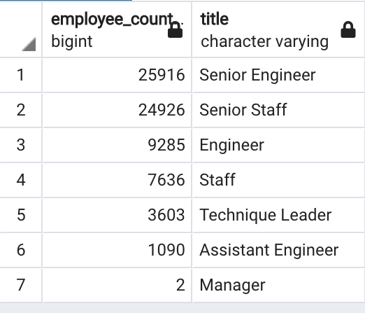
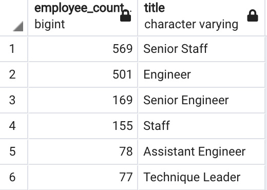

# Pewlett-Hackard-Analysis
## Overview of Analysis
The purpose of this project is to understand the impact of the "silver tsunami" will have on the Pewlett Hackard workforce.  In this analysis, I have created a table that includes the number of employees retiring based on their most recent title and secondly, created a list of employees that are eligible to participate in the Mentorship Program

## Results
From this analysis, we can now better prepare for the amount of employees that will be retiring in the next few years.  Below are the 4 key points that Pewlett Hackard will need to focus on:

- From the table above, we can see that the 2 positions with exponetially more retirees are Senior Engineers and Senior Staff.

- With such a high number of retiring Sr. Engineers and Engineers, Pewlett Hackard should begin recruiting engineering students to begin filling some entry role positions and promoting exceptional engineers,

- From the Mentorship Summary table above, there are a total of 670 engineers that look to be ready to be promoted to the next level.

- On a brighter note, we don't see many management positions coming open. This should allow for Pewlett Hackard to promote top talent into established teams with established leaders.

## Summary
To summarize this analysis, we will ultimately need to fill 72,458 jobs after the mass exodus of the "silver tsunami". On the other side, Pewlett Hackard only has 1549 employees that are deemed eligible to fill these roles.  With such a difference in those numbers, Pewlett Hackard really needs to step up their recruiting to bring in some top talent to combat the "silver tsunami".